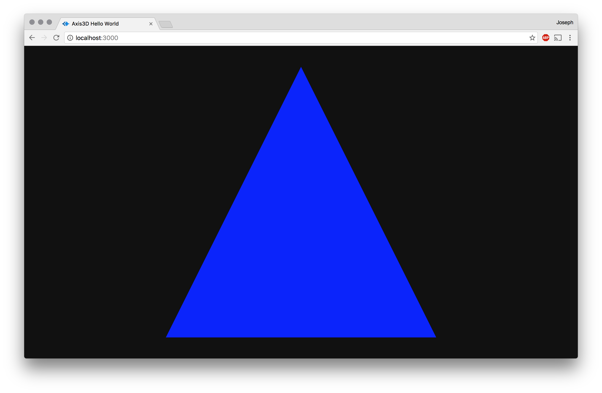

Hello World
===========

The following hello world example demonstrates rendering a blue triangle
to the screen. A `canvas` is created with a `webgl` context and
automatically appended to the `body` DOM element.

```js
'use strict'

import {
  FlatMaterial,
  BoxGeometry,
  Context,
  Camera,
  Frame,
  Mesh,
} from 'axis3d'

import quat from 'gl-quat'

const ctx = Context()

const material = FlatMaterial(ctx)
const camera = Camera(ctx, {position: [0, 0, 3]})
const frame = Frame(ctx)
const box = Mesh(ctx, { geometry: BoxGeometry(ctx) })

const rotation = [0, 0, 0, 1]
const angle = [0, 0, 0, 1]

frame(({time}) => {
  quat.setAxisAngle(angle, [0, 1, 0], 0.5*time)
  quat.slerp(rotation, rotation, angle, 0.01)
  camera({rotation}, () => {
    material({color: [0, 0, 1, 1]}, () => {
      box({wireframe: true})
    })
  })
})
```

If successful, the you should see the following:



# <a name="see-also"></a> See Also

* [Setup](setup.md)
* [Getting Started](getting-started.md)
